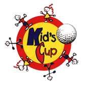

<section id="intro">
    

    <section id="intro-content">
        
        <h1 class="title">Kid's Cup Rochester</h1>
    </section>
</section>
<section id="event-details" class="has-light-gray-background">
    

        

            <h3 class="is-center-aligned is-section-heading">Next Event</h3>
        

        

            
            <h4>Date & Time</h4>
            

                {{ site.next_event.date }}
                 
                {{ site.next_event.time }}
            

        

        

            
            <h4>Location</h4>
            

                Somerby Golf Club
                 
                (<a href="{{ site.next_event.directions_url }}" target="_blank">Directions</a>)
            

        

    

</section>
<section id="who-we-are">
    

        

            <h3 class="is-center-aligned is-section-heading">Who We Are</h3>
            
            {{ site.who_we_are.content }}
        

    

</section>
<section id="what-makes-us-unique" class="has-light-gray-background">
    

        

            <h3 class="is-center-aligned is-section-heading">What Makes Us Unique</h3>
            
            
For 22 years our golfers have been raising money for the kids.  Just to play, the golfers have to raise a minimum of $500.  Many of our golfers go above and beyond the required $500 and raise up to $6,000 a year.

            
When you are asked to donate to a Kid’s Cup golfer, keep in mind you are donating to fund a project or product that is NOT in the hospitals’ budget.  The entire purpose and mission of our tournament is to make an impact on these children’s stay at the hospital, not only for the patients but for their parents and siblings.  They are generally lengthy stays, and the money raised goes to make these stays more tolerable and comfortable.

            
Over the years, the projects at Mayo Clinic have included:

            <ul>
                <li>Cast room pictures printer</li>
                <li>Marking milestones in the Neonatal NICU</li>
                <li>iPads</li>
                <li>Sibling support bags</li>
                <li>Shaken baby syndrome prevention program</li>
                <li>Equipment for PMR Med Peds</li>
                <li>Wild Encounters ZooMobile</li>
                <li>NICU stay-cations</li>
                <li>Fingerprint charms</li>
                <li>Sensory Music and Push Button Toys</li>
                <li>Simulation dolls</li>
                <li>Devices to ease blood draws</li>
            </ul>
            
In 2011, a project called “Beads of Courage” was funded at Mayo Clinic.  Beads of Courage are handed to each child who has any type of procedure whether it is a needle stick all the way to a successful day of chemotherapy.  Just imagine how many beads these kids collect over their time or trips to the hospital.  With each visit, the strings of courage beads get longer, and each bead garners a smile on a hurting or ill child.

            
With so many children wanting to share, here is Erik Sutter's story of how just one project funded by Kid's Cup impacted him while being treated for cancer:

            <blockquote>
                
While I was in the hospital, Kid's Cup helped by providing fun things to pass the time.  I spent a lot of time playing Mario Kart on the Nintendo Wii.  I also played fun games on a laptop computer.  My mom found the laptop very useful for setting up my Caring Bridge site to keep family and friends informed about my cancer.

                
During my first 18 days in the hospital, getting out of bed and walking was important for my health.  A trip down the hall to the playroom was something to look forward to.  I was impressed with all the activities the playroom had to offer.

                
Throughout the three years and two months of treatment, I was able to collect 295 colorful glass beads known as Beads of Courage.  Each bead represents a procedure or situation I had to go through.  I was proud to wear them during clinic visits so other people could see what I had accomplished!

                
The Kids Cup tournament is a fun way for adults and children to raise important funds so that kids like me can endure long days and long nights in the hospital.

                
Thank you very much Kid's Cup!

                
<em>- Erik Sutter</em>

            </blockquote>
            
In 2012, Kid's Cup made the change from supporting Gillette Children's Hospital to Olmsted Medical Center so that all the funds could be used locally.  Knowing how important the OMC BirthCenter is to the communities in Southeastern Minnesota, Kid's Cup made the first major financial pledge of $150,000 to the Capital Campaign to construct the Women's Health Pavilion on the OMC Hospital campus.  Nearly 40% of all births in Olmsted County happen in the OMC BirthCenter.  Kid's Cup is recognized for its generous support outside of the OMC BirthCenter Nursery.

        

    

</section>
<section id="whats-new">
    

        

            <h3 class="is-center-aligned is-section-heading">What's New for 2018</h3>
            
            
The Kid’s Cup has followed the same format for 21 years, but this year we’ve decided to switch things up. Instead of 36 holes played at two different golf courses, the tournament will be held at <a href="http://www.somerby.com" target="_blank">Somerby Golf Club</a>, South East Minnesota’s premiere championship golf club, on May 21, 2018. The tournament will be 18 holes, leaving more time for our golfers to enjoy dinner, along with our silent auction.

            <h5>Schedule of Events:</h5>
            <ul class="is-unbulleted-list">
                <li>9:30 AM - Registration and hot breakfast buffet</li>
                <li>11:00 AM - Shotgun start</li>
                <li>3:30 PM - Social hour and silent auction</li>
                <li>4:30 PM - Dinner (chef-carved prime rib) and awards</li>
            </ul>
        

    

</section>
<section id="sponsors" class="has-light-gray-background">
    

        

            <h3 class="is-center-aligned is-section-heading">Sponsors</h3>
        

        
            

                
                
            

        
    

</section>
<section id="sign-up">
    

        

            <h3 class="is-center-aligned is-section-heading">Sign Up</h3>
        

        

            
            <h4>For Golfers</h4>
            
Registration is easy. Simply create your fund easy page <a href="https://secure.ministrysync.com/ministrysync/event/website/home/?e=10087" target="_blank">here</a>. Once registered, you can direct potential donors to your site and share the link on Facebook and Twitter.  If you receive donations as cash or check, simply record the donations on your Fund Easy page, and bring the cash and checks to Somerby the day of the event.

            
<a class="is-button" href="https://secure.ministrysync.com/ministrysync/event/website/home/?e=10087" target="_blank">I want to golf!</a>

        

        

            
            <h4>For Sponsors</h4>
            
We understand that not everyone is a golfer. However, there are sponsorship opportunities available, along with volunteer opportunities. For more information contact Jeff Jensen (<a href="mailto:jeff.jensen@expresspros.com?subject=Kid's Cup Rochester Sponsorship">jeff.jensen@expresspros.com</a>) or Marge Kelley (<a href="mailto:marge.kelley@expresspros.com?subject=Kid's Cup Rochester Sponsorship">marge.kelley@expresspros.com</a>).

            
<a class="is-button" href="mailto:marge.kelley@expresspros.com?subject=Kid's Cup Rochester Sponsorship">I want to sponsor!</a>

        

    

</section>